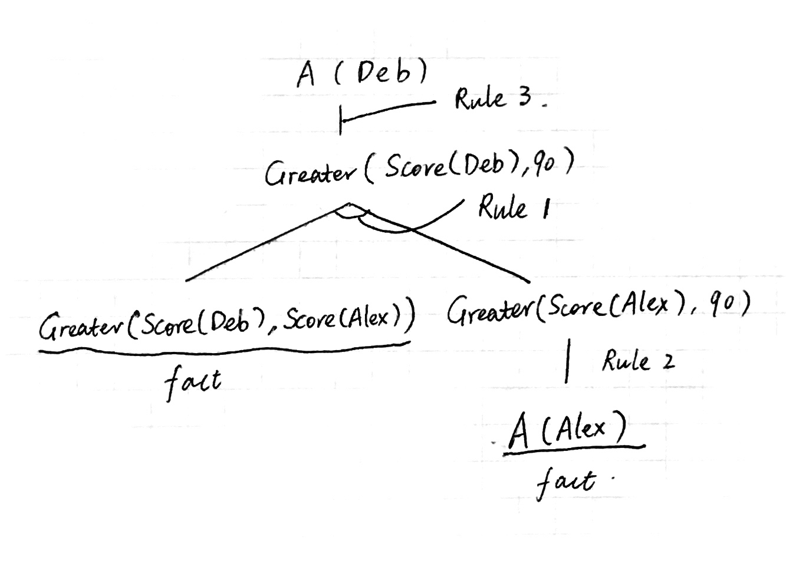

% CS683 Homework 03
% Cen Wang

# Minesweeper

## 1

There are eight squares adjacent to (1, 1). First write them down:

$$X_{0, 0} \land X_{0, 1} \land X_{0, 2} \land X_{1, 0} \land X_{1, 2} \land X_{2, 0} \land X_{2, 1} \land X_{2, 2}$$

Select two different squares from the eight as the squares having a mine inside and all others don't have a mine. We can get an example:

$$Y_1 = X_{0, 0} \land X_{0, 1} \land \lnot X_{0, 2} \land \lnot X_{1, 0} \land \lnot X_{1, 2} \land \lnot X_{2, 0} \land \lnot X_{2, 1} \land \lnot X_{2, 2}$$

There are $\binom{8}{2}$ possible outcomes to choose 2 squares out of 8. The final result is a disjunction of all the possiblities, namely, $Y_1 \lor Y_2 \lor ... \lor Y_{28}$.

## 2

Our first attempt is just write down the knowledge as previous question.

$$X_1 \land X_2 \land ... \land X_n$$

Select $k$ $X_i$ from the equation and negate all others, e.g.

$$X_1 \land X_2 \land ... \land X_k \land \lnot X_{k + 1} \land \lnot X_{k + 2} \land ... \land \lnot X_n$$

There will be $\binom{n}{k}$ different disjunctions and we can convert the DNF into a CNF using distributive law. For example,

$$(a \land b) \lor (c \land d) \lor (e \land f) = (a \lor c \lor e) \land (a \lor c \lor f) \land (a \lor d \lor e) \land (a \lor d \lor f) \land (b \lor c \lor e) \land (b \lor c \lor f) \land (b \lor d \lor e) \land (b \lor d \lor f)$$

Our second attempt is by introducing $\binom{n}{k}$ new variables $Z_i$.

Reference: [https://en.wikipedia.org/wiki/Conjunctive_normal_form](https://en.wikipedia.org/wiki/Conjunctive_normal_form).

A DNF like $(a \land b) \lor (c \land d) \lor (e \land f)$ can be converted and preserve its satisfiability into

$$(Z_1 \lor Z_2 \lor Z_3) \land (\lnot Z_1 \lor a) \land (\lnot Z_1 \lor b) \land (\lnot Z_2 \lor c) \land (\lnot Z_2 \lor d) \land (\lnot Z_3 \lor e) \land (\lnot Z_3 \lor f)$$

So our DNF can be written as $$(Z_1 \lor Z_2 \lor ... Z_{C(n, k)}) \land (\lnot Z_1 \lor X_1) \land (\lnot Z_1 \lor X_2) \land ... \land (\lnot Z_1 \lor \lnot X_n) \land ...$$

## 3

**First**, we construct an empty knowledge base **KB** and randomly probe a square. This brings some mine information.

1. For every square, if it is probed and it says that there are **m** mines nearby, then we add this knowledge as suggested in previous question to **KB**.

2. For every square, if it is probed and it says that there is no mine in the current square, then we add $\lnot X_{i, j}$ to the knowledge base.

The **KB** can be thought as `remaining mines information` $\land$ `squares having a mine` $\land$ `squares having no mine`, which is a giant CNF.

**Second**, for every square that is not probed and not inferred to have a mine, we run DPLL on that square. The input for the function can be 1) all clauses in CNF $KB \land  \lnot (\lnot X_{i, j})$ and 2) all clauses in CNF $KB \land (\lnot X_{i, j})$. The return value can be either `true` or `false`.

In the first case, if return value is `false`, it means the hypothesis that there is a mine in (i, j) is unsatisfiable. Then we just know (i, j) does not has a mine. We probe it and add the fact $\lnot X_{i, j}$ to `squares having no mine`.

In the second case, if return value is `false`, it means the hypothesis that there is no mine in (i, j) is unsatisfiable. Then we just know (i, j) has a mine. We don't probe and add $X_{i, j}$ to `squares having a mine`.

Generally, probing could bring new nearby mine information, and we should add it to **KB**. We should run this entire step repeatedly until no more inference can be made.

**Third**, the previous step has two outcomes, either we finish the game or we encounter a situation where no more inferences can be made. In this case, we have to randomly pick a square, probe it, and return to the second step.

## 4

As the first question, the global constraint can be written down

$$X_1 \land X_2 \land ... \land X_n$$

and select M clauses and flip others. This is one example:

$$X_1 \land X_2 \land ... \land X_m \land \lnot X_{m + 1} \land \lnot X_{m + 2} \land ... \land \lnot X_n$$

There will be a disjunction of $\binom{N}{M}$ clauses.

DPLL is a backtracking algorithm. The first two lines of the algorithm,

```
if every clause in clauses is true in model then return true
if some clause in clauses is false in model then return false
```

This is the base case, when every variable has been assigned a boolean value and a complete model is constructed. We propose the change:

```
count trues in the model, if number of trues are different from M, return false (unsatisfiable)
if every clause in clauses is true in model then return true
if some clause in clauses is false in model then return false
```

We can count how many `true`s are assigned to $X_{i, j}$. If the count is not equal to the global constraint that there are M mines in total, we just discard this model.

# First-order Logic 1

1

$\forall x \quad Male(x) \Rightarrow \lnot (Butcher(x) \land Vegetarian(x))$

2

$\forall x \quad Male(x) \land \lnot Butcher(x) \Rightarrow (\forall y \quad Vegetarian(y) \Rightarrow Likes(x, y))$

This expression does not rule out butchers like vegetarians. Or

$\forall x \quad Male(x) \Rightarrow \lnot Butcher(x) \Leftrightarrow (\forall y \quad Vegetarian(y) \Rightarrow Likes(x, y))$

which rules out this situation.

3

$\forall x \quad Vegetarian(x) \land Butcher(x) \Rightarrow Female(x)$

4

$\forall x \quad Male(x) \Rightarrow (\forall y \quad Female(y) \land Vegetarian(y) \Rightarrow \lnot Likes(x, y))$

5

$\forall x \quad Female(x) \Rightarrow (
	\forall y \quad Male(y) \land (\forall z \quad Vegetarian(z) \Rightarrow \lnot Likes(y, z)) \Rightarrow \lnot Likes(x, y)
)$

# First-order Logic 2

## 1

Vocabulary:

- Takes(x, c, s): person x takes course c in semester s
- Score(x, c, s): the score of person x in semester s

$\forall s \exists x \quad Takes(x, CS683, s) \land (\forall y \quad Takes(y, CS610, s) \Rightarrow Score(x, CS683, s) > Score(y, CS610, s))$

## 2

Vocabulary:

- Person(x)
- InNeighborhood(x)
- BuyInsurance(x)

$\forall x \quad Person(x) \land InNeighborhood(x) \Rightarrow \lnot BuyInsurance(x)$

## 3

Vocabulary:

- Aide(x): x is an aide of the president
- IssuedStatement(x): x has issued some statements

$\forall x \quad Aide(x) \Rightarrow \lnot IssuedStatement(x)$

## 4

Vocabulary:

- Aide(x): x is an aide of the president
- Statement(x): the statement made by x
- Conflict(x, y): statement x and y conflicts with each other

$\exists x \quad Aide(x) \land (\exists y \quad Aide(y) \land Conflict(Statement(x), Statement(y)))$

## 5

Vocabulary:

- Politician(x): x is a politician
- Person(x): x is a person
- Fools(x, y, t): x can fool y at time t

Interpreting the sentence as:

***Some*** politicians can fool some of the people all the time, and ***some*** of them can fool all the people some of the time, but ***all*** politicians can't fool all of the people all of the time.

$\alpha = \exists x Politician(x) \land (\exists y Person(y) \land (\forall t Fools(x, y, t)))$

$\beta = \exists x Politician(x) \land (\exists t \forall y Person(y) \Rightarrow Fools(x, y, t))$

$\gamma = \forall x Politician(x) \Rightarrow \lnot (\forall y \forall t Fools(x, y, t))$

The final answer is: $\alpha \land \beta \land \gamma$

# Backward-chaining

Known:

1. $\forall$x, y, z Greater(x, y) $\land$ Greater(y, z) $\Rightarrow$ Greater(x, z)
2. $\forall$x A(x) $\Rightarrow$ Greater(Score(x), 90)
3. $\forall$x Greater(Score(x), 90) $\Rightarrow$ A(x)
4. A(Alex)
5. Greater(Score(Deb), Score(Alex))

Proof:

1. To prove A(Deb), we use Rule 3 Greater(Score(Deb), 90) with {x/Deb}.
2. To prove Greater(Score(Deb), 90), we need to prove both Greater(Score(Deb), Score(Alex)) and Greater(Score(Alex), 90). This uses Rule 1: if Greater(Score(Deb), Score(Alex)) (which is a known fact) $\land$ Greater(Score(Alex), 90), then we have Greater(Score(Deb), 90). (with {x/Score(Deb), y/Score(Alex), z/90})
3. To prove Greater(Score(Alex), 90), we need to prove A(Alex) (which is a known fact) using Rule 2 with {x/Alex}.
4. We finish the proof.

The proof tree:


\ 


# Murder

The three suspects made many statements. But some of them like "I'm out of town" are useless. The **useful** statements from three suspects are:

- Arthur said: Friend(Bertram, Vincent) $\land$ Hates(Carleton, Vincent)

- Bertram said: $\lnot$ Knows(Bertram, Vincent)

- Carleton said: With(Arthur, Vincent) $\land$ With(Bertram, Vincent)

With some common knowledge:

- $\forall x, y \quad Friend(x, y) \Rightarrow Knows(x, y)$

- $\forall x, y \quad Hates(x, y) \Rightarrow Knows(x, y)$ (suppose one does not hate other people for no reason)

- $\forall x, y \quad With(x, y) \Rightarrow Knows(x, y)$

these statements can be converted to:

- Knows(Bertram, Vincent) $\land$ Knows(Carleton, Vincent)

- $\lnot$ Knows(Bertram, Vincent)

- Knows(Arthur, Vincent) $\land$ Knows(Bertram, Vincent)

This becomes propositional logic. To simplify the language, we define:

a = Knows(Arthur, Vincent)
b = Knows(Bertram, Vincent)
c = Knows(Carleton, Vincent)

Because all people except the murderer tell the truth, we have three possiblities:

- x = $\lnot (b \land c) \land \lnot b \land (a \land b)$ (Arthur is lying)

- y = $(b \land c) \land b \land (a \land b)$ (Bertram is lying)

- z = $(b \land c) \land \lnot b \land \lnot (a \land b)$ (Carleton is lying)

Then our knowledge base can be expressed as $x \lor y \lor z$.

We convert the knowledge base into CNF. Notice that x and z are always false. KB = $(b \land c) \land b \land (a \land b)$.

We now use resolution to prove the murderer.

**First**, suppose Arthur is the murderer and he lied:

His statement is Knows(Bertram, Vincent) $\land$ Knows(Carleton, Vincent), which is equivalent to $b \land c$.

$KB \land \lnot (b \land c)$. By resolution, we see an immediate conflict with $b \land c$, which is unsatisfiable and means Arthur does not lie.

**Second**, suppose Carleton is the murderer and he lied:

His statement is Knows(Arthur, Vincent) $\land$ Knows(Bertram, Vincent), which is equivalent to $a \land b$.

$KB \land \lnot (a \land b)$. By resolution, we see an immediate conflict with $a \land b$, which is unsatisfiable and means Carleton does not lie.

**Finally**, suppose Bertram is the murderer and he lied:

His statement is $\lnot$ Knows(Bertram, Vincent), which is equivalent to $\lnot b$.

$KB \land \lnot (\lnot b)$. By resolution, this is satisfiable and means it is possible that Bertram lied.

We have proved the other two suspects didn't lie and Bertram lied, so we conclude that Bertram is the murderer.

# Extra Credit

First, we construct the knowledge base **KB** = $(b \land c) \land b \land (a \land b)$.

Then, for every suspect's `statement`, we form a test: `test = kb & ~statement`. The `test` is expressed as a list of clauses, e.g. `[A & C, B, A & B, ~(B & C)]` and passed to `WalkSAT` function. The returned value of individual test can be `None` or a model which can satisfy the test.

If all tests are run and we get two `None`s and one satisfied model, the person who generate the satisfied model is the murderer. If, however, we get three `None`s, this means we didn't find a model with the allowed quota, we must increase the quota and run the program again.